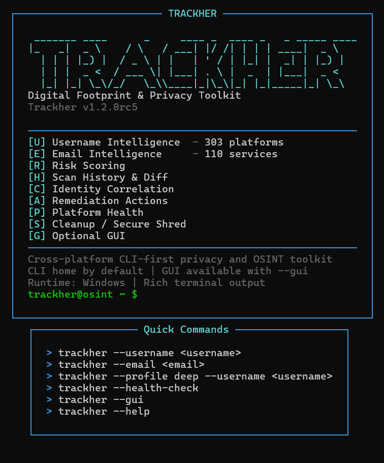

<p align="center">
  
</p>

<p align="center">
  
</p>

# Trackher

Trackher is an open-source Python Digital Footprint & Privacy Toolkit for
reviewing parts of your own digital footprint and cleaning selected local
traces on your own devices. It ships with both a CLI and a GUI, and it is
designed around cautious, evidence-based checks instead of aggressive or
side-effectful probing.

> Trackher should only be used on accounts, usernames, and devices that belong
> to you, or for which you have explicit permission. See
> [ETHICS.md](ETHICS.md) for the usage policy.

## Why Trackher

- CLI + GUI
- Username OSINT across public profile patterns
- Email account intelligence with verified, possible, unknown, and manual separation
- Breach exposure checks through Have I Been Pwned
- Search engine dorks for manual investigation
- Local cleanup tools for shell history, browser traces, and system caches
- Best-effort secure deletion for files and directories
- HTML and JSON reporting
- Risk scoring, scan history, remediation actions, identity correlation, and platform health
- Dry-run support before any destructive action
- Windows, macOS, and Linux support
- Scheduled cleanup support for Windows Task Scheduler, macOS `launchd`, and Linux `cron`

## Safety Model

Trackher is intentionally conservative.

- Risky account checks that may trigger password resets, OTP messages, sign-in
  notices, or other side effects are skipped.
- Destructive actions require either `--dry-run`, interactive confirmation, or
  an explicit `--yes` flag.
- Critical system paths, user root paths, and protected exclusions are blocked
  from bulk deletion.
- HTML reports escape dynamic values and reject unsafe links.
- Local scan history and platform health state stay on the local machine.

## Features

### OSINT

- Username scan across 197 platforms
- Email OSINT with a catalog of 110 services
- Only a small side-effect-free subset is automatically checkable today
- Automatic email checks currently include Gravatar, GitLab, and GitHub
- Search engine dork generation for manual investigation

Email results are separated as:

- `FOUND`: verified passive evidence
- `NOT_FOUND`: reliably checked and absent
- `POSSIBLE`: heuristic evidence only
- `UNKNOWN`: inconclusive or error
- `MANUAL`: no safe automatic check is available

`Have I Been Pwned` is kept separate under `Breaches` and uses `HIBP_API_KEY`
when configured.

### Scan Profiles

Use `--profile` to choose how broad a scan should be.

- `quick`: verified and high-confidence checks only
- `standard`: current default behavior
- `deep`: currently matches `standard`; reserved for broader coverage
- `username-only`: run username OSINT only
- `email-only`: run email OSINT only

### Scan History + Diff

Trackher stores normalized local snapshots and compares each scan against the
previous matching scan.

- Use `--no-history` to disable storage and diffing for a run
- Use `--clear-history` to remove local history data
- If two scans use different profiles, Trackher warns that diff coverage differs

### Identity Correlation

Trackher can group public findings that may belong to the same digital identity.
This is probabilistic, not certain, and it is based only on public signals such
as the same username, display name, avatar hash, linked website/domain, or
matching public profile metadata.

### Risk Score

Trackher includes an explainable Digital Footprint Risk Score from `0` to `100`.

- Levels: `LOW`, `MEDIUM`, `HIGH`, `CRITICAL`
- The score is based only on scan evidence
- Verified findings contribute more than heuristic or unreliable findings
- `MANUAL`, `UNKNOWN`, and `ERROR` do not increase the score
- Breaches contribute to risk
- Category caps prevent one finding type from dominating
- The score is not a scientific measurement or a security guarantee

### Platform / Detector Health

Trackher can check platform and detector health separately from normal scans.

- `--health-check` runs offline schema and catalog validation
- `--health-check-live` adds optional safe live probes where supported
- Health data is cached locally and does not affect normal scan behavior

### Remediation / Privacy Actions

When Trackher finds an exposure, it can show official user-facing links for
privacy settings, account security, data export, deletion help, or profile
pages. It never automates those actions.

### Cleanup

- Shell and terminal history cleanup
- Browser cache and selected browser trace cleanup
- Cross-platform system temp and cache cleanup
- Exclusion list support through JSON config

### Secure Deletion

- Best-effort overwrite and delete for files
- Recursive directory shredding
- Symlink and critical-path protections
- Secure deletion is still best-effort on SSD, copy-on-write, journaled, or
  network-backed file systems

## Requirements

- Python 3.10 or newer
- Internet connection for OSINT features
- Tk support for the GUI

If Tk is missing on Debian or Ubuntu:

```bash
sudo apt install python3-tk
```

## Dependencies

Main runtime dependencies: `rich`, `httpx`, `customtkinter`, `Pillow`

## Installation

### Developer source run

Windows PowerShell:

```powershell
py -3 -m venv .venv
.\.venv\Scripts\Activate.ps1
python -m pip install --upgrade pip
python -m pip install -r requirements.txt
python main.py
```

macOS / Linux:

```bash
python3 -m venv .venv
source .venv/bin/activate
python -m pip install --upgrade pip
python -m pip install -r requirements.txt
python main.py
```

Running `python main.py` with no arguments launches the GUI if GUI
dependencies are available. Passing arguments runs the CLI mode.

### Installed CLI

```bash
python -m pip install .
trackher --version
trackher --username example_user
```

### Windows packaged build

The packaging workflow produces a standalone Windows bundle that launches the
GUI on double-click and also supports CLI arguments:

```powershell
.\Trackher.exe
.\Trackher.exe --username example_user
```

## Quick Start

### Email checks

```bash
python main.py --email analyst@example.com
```

```text
Email Account Discovery

Verified Accounts
✓ Gravatar

Possible Accounts
~ GitHub - Public profile email matched exactly (exampleuser)

Breaches
! Have I Been Pwned: NOT CONFIGURED

Manual Investigation
Most remaining services require manual review.
Use --show-manual to display them.
```

```bash
python main.py --email analyst@example.com --show-manual --search-dork
```

```text
Email Account Discovery

Verified Accounts
✓ Gravatar

Possible Accounts
~ GitHub - Public profile email matched exactly (exampleuser)

Manual Investigation
> Figma
> Notion
> Trello
...

Breaches
! Have I Been Pwned: NOT CONFIGURED
```

### Username checks

```bash
python main.py --username example_user --search-dork
```

```text
[INFO] Taraniyor: example_user
[+] Found on 3/197 platforms: Reddit, GitLab, Medium
[?] 4 platform checks could not be verified
[INFO] Google, Bing, DuckDuckGo, and Yandex dorks generated
```

```bash
python main.py --username example_user
```

```text
[INFO] Taraniyor: example_user
[+] Found on 2/197 platforms: Reddit, Medium
[?] 3 platform checks could not be verified
```

### Cleanup preview and execution

```bash
python main.py --clean-all --dry-run
python main.py --clean-all --yes
python main.py --clean-browser --clean-system --dry-run
```

### Exclusions

```bash
python main.py --clean-all --dry-run --exclude exclusions.example.json
```

### Secure deletion

```bash
python main.py --shred /path/to/file --dry-run
python main.py --shred /path/to/file --yes
```

### Scheduled cleanup

```bash
python main.py --schedule weekly --dry-run
python main.py --schedule weekly --yes
```

## Reports

Trackher can generate reports in HTML or JSON:

```bash
python main.py --email analyst@example.com --report html
python main.py --email analyst@example.com --report json
python main.py --username example_user --report html
python main.py --username example_user --report json
```

Generated report filenames follow this pattern:

- `trackher_report_html.html`
- `trackher_report_json.json`

These files are already ignored by `.gitignore`.

Reported vulnerabilities are handled through the disclosure process described in
[SECURITY.md](SECURITY.md).

## HIBP API Key

Have I Been Pwned support is optional. Without `HIBP_API_KEY`, Trackher keeps
running and reports `NOT CONFIGURED` for that provider.

PowerShell:

```powershell
$env:HIBP_API_KEY = "<key>"
```

macOS / Linux:

```bash
export HIBP_API_KEY="<key>"
```

## Common Flags

- `--show-manual`: reveal manual email services in the console output
- `--no-history`: skip local scan history storage and diffing
- `--clear-history`: remove local scan history
- `--health-check`: run offline catalog and schema health checks
- `--health-check-live`: add safe live health probes where supported
- `--profile quick|standard|deep|username-only|email-only`: choose scan breadth

## Platform Support

| Feature | Windows | macOS | Linux |
|---|:---:|:---:|:---:|
| GUI | Yes | Yes | Yes |
| CLI | Yes | Yes | Yes |
| OSINT | Yes | Yes | Yes |
| Cleanup | Yes | Yes | Yes |
| Scheduling | Yes | Yes | Yes |
| Context menu helper | Yes | No | Limited |

## Testing

```bash
python -m pip check
python -m compileall -q footprint osint utils gui.py main.py setup_context_menu.py
python -m unittest discover -s tests -v
```

The project includes automated tests for:

- Cross-platform cleanup path selection
- Safe deletion and exclusion handling
- HTML report escaping
- Non-interactive destructive action protection
- Username detection rules
- Email status grouping and HIBP configuration handling
- GUI queue and terminal memory behavior

## Repository Guide

- [CONTRIBUTING.md](CONTRIBUTING.md): contribution workflow
- [SECURITY.md](SECURITY.md): security disclosure policy
- [ETHICS.md](ETHICS.md): acceptable use policy
- [CHANGELOG.md](CHANGELOG.md): release history
- [CODE_OF_CONDUCT.md](CODE_OF_CONDUCT.md): community expectations

## Limitations

- Secure deletion is best-effort and cannot guarantee physical overwrite on SSD,
  copy-on-write, journaled, compressed, or network-backed file systems.
- OSINT results can change as services update their behavior, anti-bot rules,
  or public endpoints.
- Identity correlation is probabilistic and should not be treated as proof of
  identity or account ownership.
- Risk scores are explainable heuristics, not scientific or security guarantees.

## License

This project is released under the MIT License. See [LICENSE](LICENSE).
